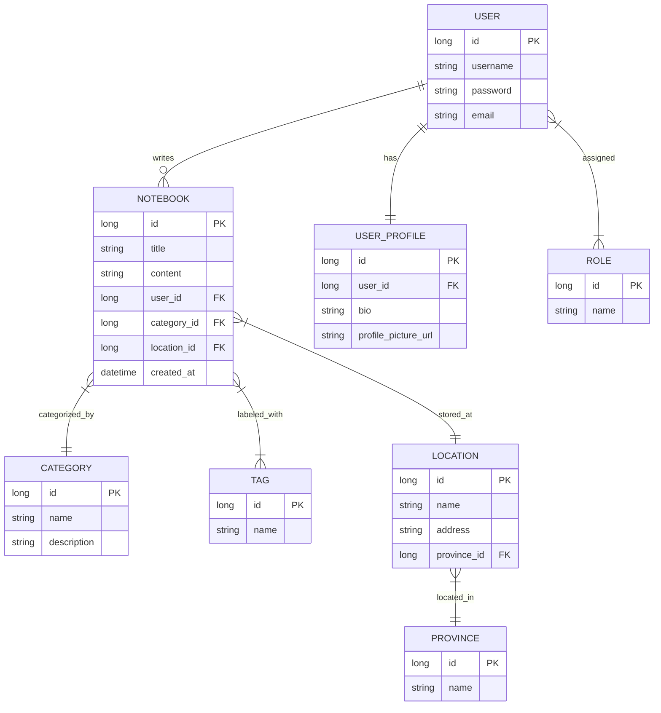

# Notebook Management System ERD

This diagram illustrates the relational structure of the system, adhering to standard JPA/Spring Boot conventions.

```mermaid
erDiagram
    USER ||--o{ NOTEBOOK : "writes"
    USER ||--|| USER_PROFILE : "has"
    USER }|--|{ ROLE : "assigned"
    NOTEBOOK }|--|| CATEGORY : "categorized_by"
    NOTEBOOK }|--|{ TAG : "labeled_with"
    NOTEBOOK }|--|| LOCATION : "stored_at"
    LOCATION }|--|| PROVINCE : "located_in"

    USER {
        long id PK
        string username
        string password
        string email
    }

    USER_PROFILE {
        long id PK
        long user_id FK
        string bio
        string profile_picture_url
    }

    ROLE {
        long id PK
        string name
    }

    NOTEBOOK {
        long id PK
        string title
        string content
        long user_id FK
        long category_id FK
        long location_id FK
        datetime created_at
    }

    CATEGORY {
        long id PK
        string name
        string description
    }

    TAG {
        long id PK
        string name
    }

    LOCATION {
        long id PK
        string name
        string address
        long province_id FK
    }

    PROVINCE {
        long id PK
        string name
    }
```
